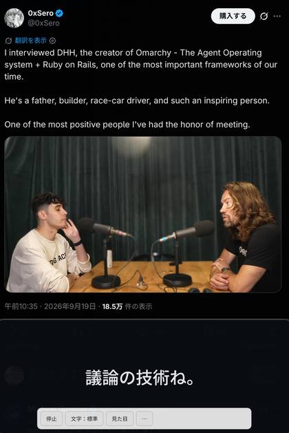
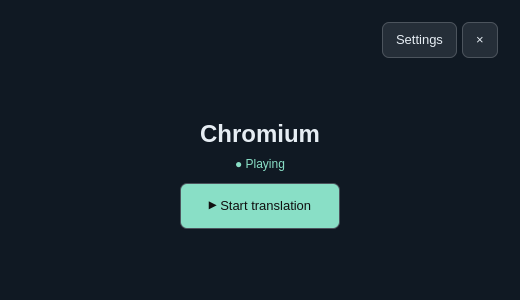
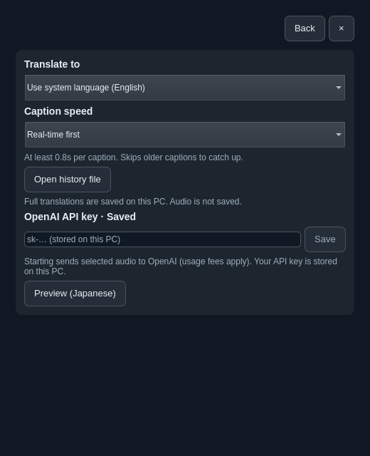

# Jimaku · 字幕

Live translated subtitles for app audio on **Omarchy**. Play audio in an app, click **Start translation**, and read the translation in a separate, resizable window. It works with capturable PipeWire-Pulse playback streams, including browsers and media players.

[日本語](README.ja.md) · [Testing](TESTING.md) · [Release checklist](docs/PUBLISHING.md) · [MIT license](LICENSE)

[](docs/live-example.png)

*Jimaku in use: Japanese translation displayed beneath a video on X. Actual user-provided screenshot; video from [this post by @0xSero](https://x.com/0xSero/status/2101122910098211201). The subtitle window is separate from the video player.*

### Start with detected app audio



### Choose your language and caption speed



*The two interface previews above render the actual UI with synthetic data and the standalone dark palette. No media was captured or translated for these images. When installed, controls follow your Omarchy theme.*

## Why I built it

I wanted to watch English-language videos with Japanese subtitles, but Chrome's built-in captioning and translation did not work reliably in my setup. X offered video captions, but I could not translate those captions in the viewing experience I was using.

I watch X in **[Biscuit](https://eatbiscuit.com/)**, an Electron-based app browser, so a solution limited to Chrome would not cover how I actually watch videos. I wanted translation to work with audio from any app, independently of the browser or the video's own caption controls.

Jimaku translates a selected app's playback stream and displays the result in a separate window. It does not need the video to provide captions or a browser extension to read the page. On Omarchy, the audio source must be exposed as a capturable PipeWire-Pulse playback stream; browsers may group multiple tabs into one stream.

## Features

- Automatically discovers active playback streams; one source is selected for you.
- Translation-only captions, with punctuation-aware segmentation and automatic font sizing.
- Real-time first (default) or readability first; both shorten display times when captions queue up.
- Pointer-activated controls that hide after inactivity, including expanded appearance menus.
- 13 translation targets, initially selected from the OS locale. Japanese/English interface and Omarchy theme colors.
- Local translation history, opened from Settings in your default text editor.

## Why “Jimaku”?

**Jimaku** (字幕, *じまく*) means “subtitles” or “captions” in Japanese. Jimaku is an independent community plugin, not an official Omarchy or OpenAI product.

## Requirements

- Omarchy with **Omarchy Shell plugin support** (`omarchy plugin`, `omarchy-shell`, Quickshell). Older Waybar-only installations are not supported.
- PipeWire-Pulse and `pactl` / `parec`, Python 3.11+, and `uv`.
- An OpenAI API key with billing and access to `gpt-realtime-translate`. API use is paid separately; see [current pricing](https://developers.openai.com/api/docs/models/gpt-realtime-translate).

## Install

Install from the public repository, then set up the Python runtime:

```bash
omarchy plugin add https://github.com/agata/omarchy-jimaku.git --enable
bash "${XDG_CONFIG_HOME:-$HOME/.config}/omarchy/plugins/io.github.agata.jimaku/setup.sh"
```

Alternatively, download or clone this repository to a permanent directory, review the code, and run:

```bash
bash install.sh
```

This validates the plugin, installs pinned Python dependencies in `${XDG_DATA_HOME:-$HOME/.local/share}/jimaku/runtime`, links this checkout into Omarchy's user plugins directory, and enables it. It requires a running Omarchy Shell session. It does not use sudo or edit your desktop configuration. Do not move a linked checkout.

If installed through `omarchy plugin add` or the plugin menu, Omarchy **does not run setup scripts**. Run this once after installation, and again after updates:

```bash
bash "${XDG_CONFIG_HOME:-$HOME/.config}/omarchy/plugins/io.github.agata.jimaku/setup.sh"
```

Then close and reopen Jimaku. Missing dependencies produce a setup message rather than starting a translation session. Only the explicit setup command downloads dependencies; opening the plugin does not.

### Floating window

For Omarchy's Lua-based Hyprland configuration, add the following to `~/.config/hypr/hyprland.lua`, then run `hyprctl reload`:

```lua
-- Jimaku floating captions
o.window({ title = "^Jimaku — Live captions$" }, { float = true })
```

Resize and move the window using your usual window-manager controls. The plugin ID is `io.github.agata.jimaku`; settings and history use the `jimaku` directories.

## Use

1. Open the captions icon in the bar and save your API key in Settings.
2. Play audio in another application. Jimaku refreshes playback sources automatically. If multiple streams exist, select the intended one.
3. Click **Start translation** to begin sending that stream and enter subtitle mode.
4. Move the pointer over subtitles to show controls. Adjust text size preference and appearance, or open **⋯** for speed, settings and the main screen.
5. **Stop**, **Ctrl+Space**, or closing the window stops translation. **Esc**, double-click and right-click return to the main screen **without stopping translation**.

Settings includes a sample demo that uses no audio capture, API calls or history writes. Its fixed Japanese sample is not a live translation.

**Translation language:** OS locale by default; unsupported locales fall back to English. Supported targets: English, Japanese, Chinese, Korean, Spanish, Portuguese, French, German, Italian, Russian, Hindi, Indonesian and Vietnamese. Change the target while stopped. Interface language is independently Japanese for a Japanese OS locale, otherwise English.

**Caption speed:** Real-time first keeps each cue for at least 0.8 seconds, waits up to 1.8 seconds for punctuation, and skips older queued cues under pressure. Readability first normally keeps cues for 2.2–6 seconds, shortening toward a 1-second floor as the queue grows. Both have a bounded queue; neither guarantees every cue will appear. Full received translations are still saved to history. API latency cannot be removed, and Jimaku does not delay the video to synchronize it.

## Privacy and data

Audio is sent to OpenAI **only after Start translation**. Discovery merely lists playback streams. Jimaku captures the selected playback stream, never automatically switching to the microphone or all system audio. Browsers may combine several tabs into one stream: stop other tabs first.

| Local data | Default path | Storage |
| --- | --- | --- |
| API key | `~/.config/jimaku/openai-key` | Plain text, owner-only permissions (0600) |
| Preferences | `~/.config/jimaku/settings.json` | Local JSON |
| Translated text | `~/.local/share/jimaku/translations.txt` | Append-only plain text, 0600; timestamp and target language |
| Python runtime | `~/.local/share/jimaku/runtime/` | Rebuildable with `setup.sh` |

`XDG_CONFIG_HOME` and `XDG_DATA_HOME` override these base directories. `OPENAI_API_KEY`, if set in the desktop session, takes precedence over the saved key. Keys and history are **not encrypted**. Audio and source transcripts are not saved. There is no analytics. History is not automatically rotated; manage or delete the text file while translation is stopped. OpenAI's handling of submitted audio is governed by your API account and provider policies.

Playback disappearance or device changes stop capture. Sessions stop after about 10 seconds of near silence or paused/muted playback or one hour. Network failures require a manual restart; there is no automatic reconnect. Translation quality and latency vary.

## Update and remove

For git-managed marketplace installations:

```bash
omarchy plugin update io.github.agata.jimaku
bash "${XDG_CONFIG_HOME:-$HOME/.config}/omarchy/plugins/io.github.agata.jimaku/setup.sh"
```

For a linked checkout, update your checkout and rerun `bash setup.sh`. Close and reopen Jimaku after setup. If QML changes remain cached, stop translation before running `omarchy restart shell` (restarts the entire desktop shell).

Stop translation before removing:

```bash
omarchy plugin remove io.github.agata.jimaku
```

Omarchy removes the plugin registration/checkout or link. Local keys, preferences, runtime and history remain. For full removal, separately delete the `jimaku` directories under your XDG config/data locations after saving any history you need, and remove the optional floating-window rule. A linked source checkout remains yours to remove.

## Troubleshooting

- **Setup required:** run `setup.sh`; it checks prerequisites and installs the pinned dependency. Re-run after a system Python upgrade too.
- **No playback source:** start playback and check the application is not paused/muted. Discovery uses stream state, not sound recognition; silent but active streams may appear.
- **Connection failed:** check API billing, model access, connectivity and your key. Sensitive provider responses are not written to logs.
- **Captions arrive late:** use Real-time first. API latency and application audio buffering still apply.
- **Floating rule has no effect:** the example above is for Lua-based Hyprland. Use the rule syntax supported by your installed Hyprland version.

## Development

```bash
bash setup.sh
bash scripts/test.sh
```

Tests use synthetic text and mocked API sessions, not paid translation calls. See [TESTING.md](TESTING.md) for optional Qt checks and coverage limits. Contributions should include a focused regression check and preserve safe stopping, private key handling, and existing settings compatibility.

References: [Omarchy shell plugins](https://omarchy.org/manual/shell-plugins/), [marketplace publishing](https://plugins.omarchy.org/publish.html), [OpenAI translation API](https://developers.openai.com/api/docs/guides/realtime-translation).
